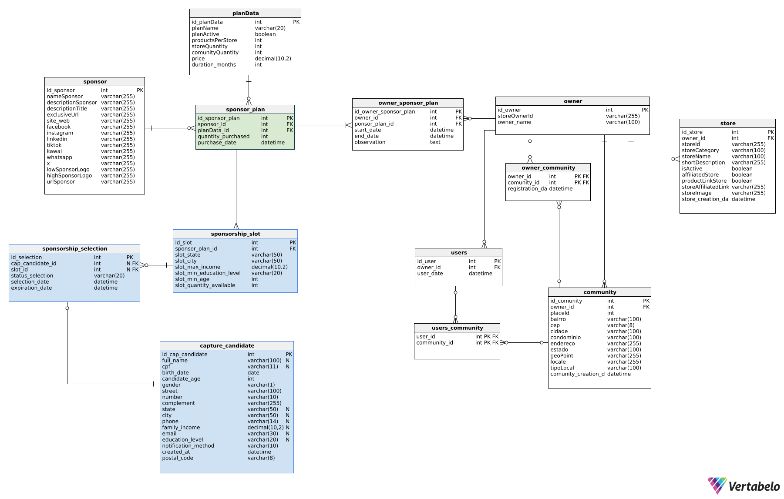

# Helpnei Sponsorship & Dashboard System

This project is part of an academic initiative that integrates **relational database modeling**, **business rules**, **data integrity**, and **automated backend processes** for a real-world scenario involving **sponsorship management** and **platform performance tracking**.

---

## 🧩 Project Context

**Helpnei** is a platform that allows independent sellers to promote products. The company offers **sponsorship plans**, where companies can finance users to become active sellers.

This system was designed to:

- Capture and analyze candidates who apply for sponsorship.
- Manage sponsor plans, selection rules, and availability.
- Track platform impact through dashboards (e.g., number of stores, users, communities created).

---

## 🧠 Problem Statement

Sponsors may purchase sponsorship plans that are later allocated to candidates. Each plan includes a specific number of available slots. Candidates who meet criteria such as **income**, **education**, **state/city** may apply for open slots.

However, Helpnei needs to ensure:

- Fair selection.
- Slot availability control.
- Expiration if a candidate does not activate their sponsorship on time.
- Integration with the platform's app (to confirm whether a sponsored user actually joined the system).

---

## 🗃️ Database Modules

### 1. **Dashboard Module**
Tracks and evaluates results based on sponsorships:

- `sponsor_plan`, `owner_sponsor_plan`: tracks who sponsored whom and when.
- Views track the creation of:
  - Stores.
  - Users.
  - Communities.
  - Total user impact.

### 2. **Sponsorship Capture Module**
Handles registration and evaluation of sponsorship candidates:

- `capture_candidate`: holds personal and socioeconomic data.
- `sponsorship_slot`: defines location and eligibility constraints.
- `sponsorship_selection`: connects candidates to slots and manages the decision status.

---

### 📐 Database Schema

[](./assets/helpnei_database_schema.png)

> The diagram above illustrates the modular structure of the system, highlighting the **Dashboard Module** and the **Sponsorship Capture Module**, their entities, relationships, and how they ensure referential integrity and scalability.

---

## 🔄 Automated Rules

Implemented with **MySQL Triggers** and **Event Scheduler**:

- ⏱ `expiration_date` auto-set to 3 days after selection.
- ❌ Rejection after 3 days if user doesn't join the platform.
- ➖ Decrements slot availability upon selection.
- ➕ Increments slot availability if an approved selection is deleted.
- 🚫 Prevents duplicate candidate registration within 30 days based on CPF (national ID).

---

## 📊 Views (Examples)

```sql
-- List active sponsorships
CREATE VIEW vw_active_sponsored_owners AS
SELECT ...
FROM owner_sponsor_plan
JOIN owner ...
WHERE NOW() BETWEEN start_date AND end_date;
```

Other views:
- `vw_store_impact`
- `vw_user_impact`
- `vw_community_impact`
- `vw_total_impacted_users`

---

## 🐳 Docker Setup

The database runs inside a Docker container with:
- `init.sql` – creates tables and indexes
- `views.sql` – loads SQL views
- `triggers_and_events.sql` – triggers and scheduled automation

All scripts are versioned and isolated for clarity.

---

## ✅ Key Highlights

- Clean relational modeling with strong referential integrity.
- Clear separation between dashboard and sponsorship capture logic.
- Protection against misuse through scheduling and triggers.
- Easily extendable by backend teams with API integrations.

---

### 📁 Documentation

Additional technical instructions for backend and Prisma integration are located in the [`/docs`](./docs) folder:

- [`backend_instructions.md`](./docs/backend_instructions.md) – Backend responsibilities when using **MySQL triggers** and **event schedulers**.
- [`prisma_instructions.md`](./docs/prisma_instructions.md) – How to use **Prisma ORM** with this database, including schema generation and query examples for SQL views.

These files provide step-by-step guidance for integrating this architecture with Node.js backends using Prisma.

---

## 🧠 Designed By

This model was fully developed and documented by **Emanuelle Oliveira**, as a personal portfolio project and academic submission.

> Feel free to fork this repository, open issues, or suggest improvements!
